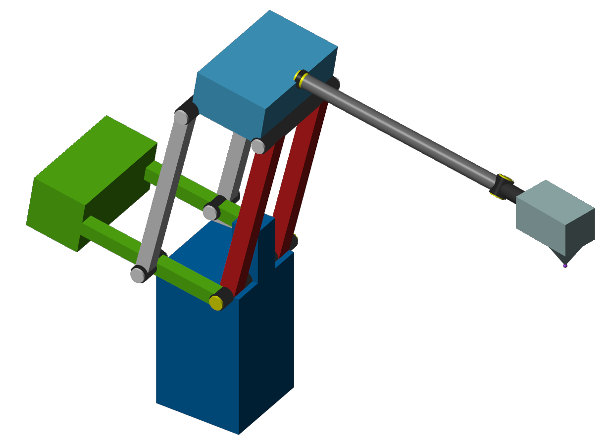

# MAS419 Project: Robot Arm

*Project for the MSc. course MAS419 Modeling and Simulation of Mechatronics Systems*



## Project Overview

The project is mainly divided into four parts:

1) Simscape modeling of the robot in Simulink
2) Path Generation in MATLAB
3) Inverse Kinematics
4) Controller Design

## Simscape Modeling
Models and relevant files for project

## Path Generation

- 3D constant script
- 2D and 3D variable script

## TBA More

## General Information

**- The project for mechatronics MSc. students is the robot project**

<span style="color:grey"> - The project for renewable MSc. students is the wind turbine project</span>

- Recommended additional help for project:
https://www.youtube.com/@DrSurajJaiswal

## Project Supplementary Lectures

### Project Supplement 1: Modeling and simulation using Simscape (Robotic systems, gear systems)

- Contains lecture videos from Michael Rygaard Hansen
- 8 Systems modeled in Simscape
- Original and corrected solutions
- Systems modeled by Thomas Lønne Stiansen

### Project supplement 2: Path generation for robot manipulator

- From lecture videos by Mohammad Ali Poursina (not included in repo)
- Path generation for 2-dimensional points
- Not modular in this code, see pathGeneration folder in root directory

### Project Supplement 3: Inverse kinematics (Hand of God)

- Hand of God Simulink model
- Rest were only hand written on whiteboard in physical class

## Importing MATLAB *(.m)* to Simulink

Importing the arrays from MATLAB to simulink can be done in multiple ways, 
the chosen method for this project goes as follows:

1) Navigate to initializer script: \
Modeling (ribbon) $\rightarrow$ Design $\rightarrow$ Property Inspector 
$\rightarrow$ Click somewhere on the model with no component so nothing 
is selected $\rightarrow$ Callbacks $\rightarrow$ Switch to InitFcn 
$\rightarrow$ Write initializer function

2) Example for script to run matlab code:
```matlab
cwd = pwd;
cd('../otherFolder')
run('exampleScript.m')
```

## Importing workspace *(.mat)* to Simulink
Importing the arrays saved in a workspace file can also be done multiple
ways. Previous version/commit of FD model used a constant block with which 
worked but had performance issues. Increased performance with InitFcn and 
"From Workspace" block:

1) Load the workspace in initializer script: \
Modeling (ribbon) $\rightarrow$ Design $\rightarrow$ Property Inspector 
$\rightarrow$ Click somewhere on the model with no component so nothing 
is selected $\rightarrow$ Callbacks $\rightarrow$ Switch to InitFcn 
$\rightarrow$ Write initializer function \
```matlab
load('workspaceName.mat')
```

2) If needed: Process data so it can be used directly into the "From 
Workspace" blocks. Needs to be time in first column, data in second. 
Example from project:
```matlab
data = matrixWithRowSeparation';
sig1  = data(:,[1  2]);
sig2 = data(:,[1  3]);
% ...
```

3) Simply use the variable in the "From Workspace" block. *(remember to 
set constant sample time?)*