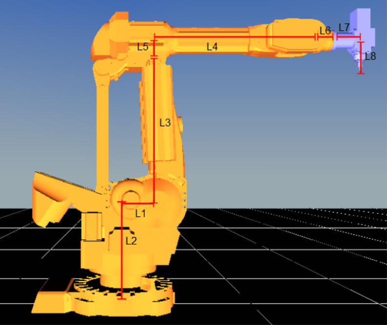
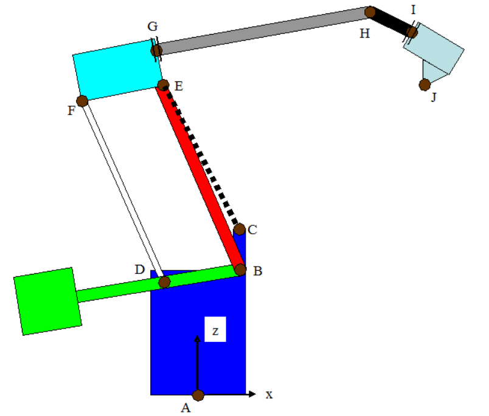

# MAS419 Project: Robot Arm

*Project for the MSc. course MAS419 Modeling and Simulation of Mechatronics Systems*

## Project Overview

The project is mainly divided into four parts:

1) Simscape modeling of the robot in Simulink
2) Path Generation in MATLAB
3) Inverse Kinematics
4) Controller Design

## Simscape Modeling
Models and relevant files for project

## Path Generation

- 3D constant script
- 2D variable script

## TBA More

## General Information

**- The project for mechatronics MSc. students is the robot project**

 - The project for renewable MSc. students is the wind turbine project

- Recommended additional help for project:
https://www.youtube.com/@DrSurajJaiswal

## Project Supplementary Lectures

### Project Supplement 1: Modeling and simulation using Simscape (Robotic systems, gear systems)

- Contains lecture videos from Michael Rygaard Hansen
- 8 Systems modeled in Simscape
- Original and corrected solutions
- Systems modeled by Thomas Lønne Stiansen

### Project supplement 2: Path generation for robot manipulator

- Path generation for 2-dimensional points
- Not modular in this code, see pathGeneration folder in root directory
